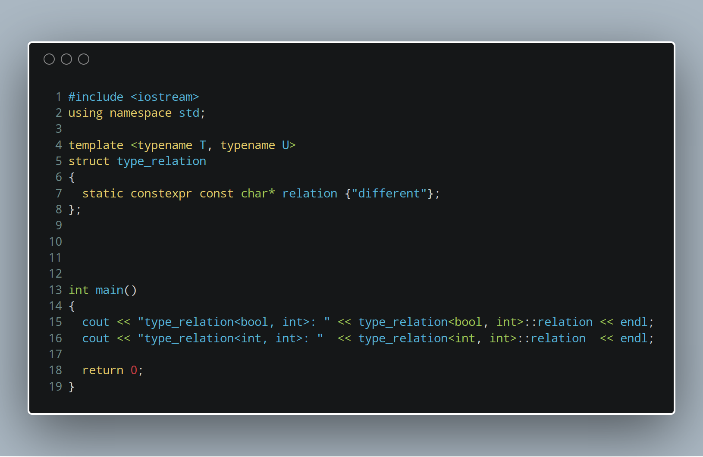
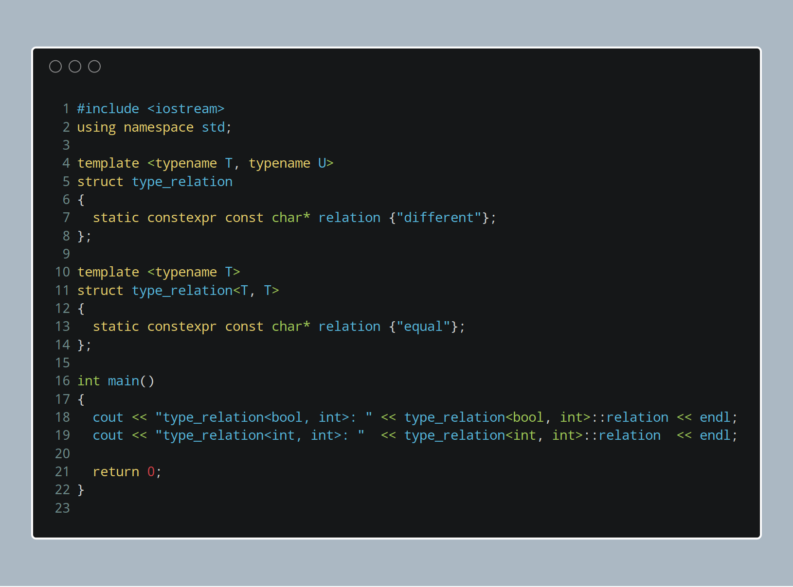
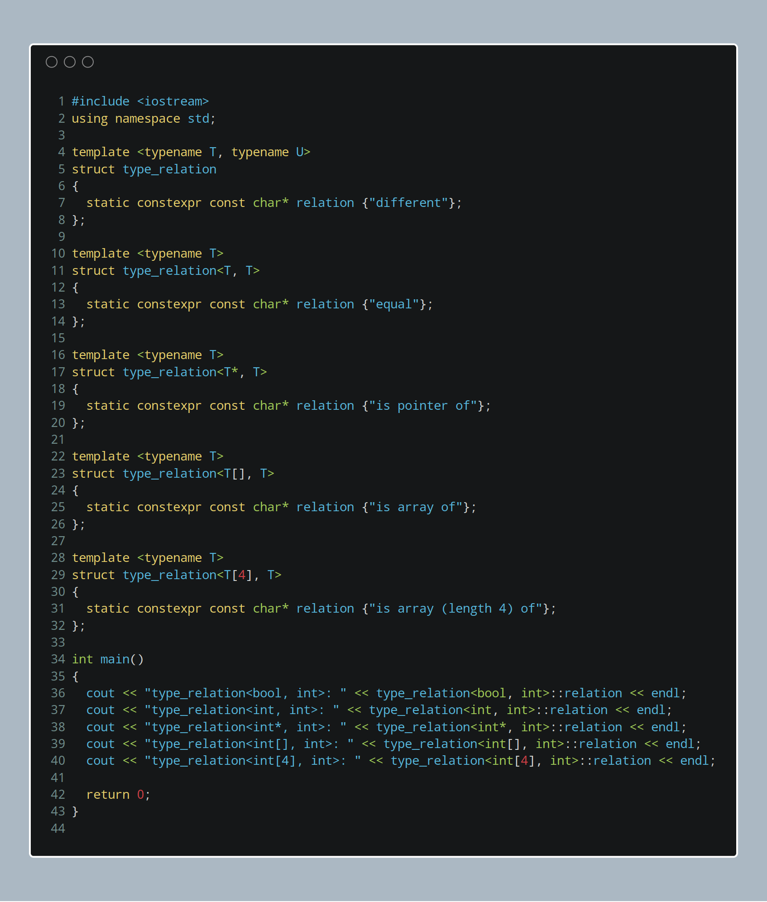

C++ 是我学习的第一种编程语言，当时是 2007 年。现在 C++ 标准委员会已经在讨论 2020 年要发布的特性了，我连 2011 年发布的 Traits 都还不知道是啥。今天下定决心了解总结一下。

C++ 之父 Bjarne Stroustrup 说：

> Think of a trait as a small object whose main purpose is to carry information used by another object or algorithm to determine “policy” or “implementation details”.

嗯，这段描述也比较抽象。我的理解是，trait 把不同类型的特定信息进行打包，用在算法或者其他对象中。这样算法或者其他对象的设计可以做到更加通用，通过 trait 打包的信息进行策略选择或者实现细节。



这段代码判断两个类型的关系。第 4 行的模板以两个类型作为参数，通过结构体 `type_relation` 的成员 `relation` 获取比较结果。当前代码输出：

```output
type_relation<bool, int>: different
type_relation<int, int>: different
```

这段代码并未实现预期功能，因为比较 `bool` 和 `int`，以及 `int` 和 `int` 时，都输出 `"different"` 。下面继续完善这个 trait 实现。



第 11 行的类型参数种使用 `<T, T>` （即两个相同的类型）进行模式匹配。这段代码输出：

```output
type_relation<bool, int>: different
type_relation<int, int>: equal
```

输出结果正确完成了类型比较的功能。

---

**实现**

trait 的实现基于 C++ 的模板引擎（template engine），能够在**编译时期（compile time）**将模板（基于最匹配的模式）展开。如果要在 Golang 或者 Java 种实现类似功能，可以使用反射或者 interface 之类的方法，而这些方法都是在运行时（runtime）进行判定，不可避免带来性能开销。

---

**进阶**

除了可以比较两个类型是否相等，还可以在类型参数上添加其他约束，例如：`*`、`[]` 等。下面是一个稍微复杂一些的版本：



```output
type_relation<bool, int>: different
type_relation<int, int>: equal
type_relation<int*, int>: is pointer of
type_relation<int[], int>: is array of
type_relation<int[4], int>: is array (length 4) of
```

当然这个“进阶”仅仅是比上面的例子复杂了一些，trait 还有更多能力。
C++ 的模板引擎为 C++ 提供了强大的元编程（meta programming）能力，也使得现代的 C++ 代码看上去比较奇怪。
事实上模板引擎是图灵完备的，如果使用好的话，能够将 C++ 的易用性和优雅性提升到一个高度（从那些看不到模板实现细节的用户的视角）。

---

**感想**

每次 C++ 标准更新的新闻我都看到了，从 C++0X、C++11、C++14 到 C++17，新出的特性一直在关注，可却从来没有真正编写一段程序去试试这些特性。这让我很伤感。

看到新的语言就想去尝试，OCaml、Clojure、Haskell …… 这些语言都很有特色，OCaml 让我体会到模式匹配的爽快，Clojure 让我体会到 S-表达式的自由和 Lisp 宏的强大，Haskell 让我体会到抽象的威力以及自己脑容量的有限。可是工作中用的最多的还是 Python、Java 和 C，当然还有 PHP （这个不能忘）。

想我和 C++ 的关系，最初的时候还是看的 Bjarne Stroustrup 的《The C++ Programming Language》。后来怎么就越走越远了呢？虽然现在工作中暂时依旧用不到，还是希望以此为契机，了解更多模板引擎可以做的事情。

追逐过的其他语言，各有各的契机，或许是缘分，或许是喜欢，或许是虚荣。现在都不敢说自己会 C++ 了。
如果当时能够更专注一些，自己目前的职业轨迹会不会有所区别？

想起最初自己理解 Haskell 里 `Monad` 概念的时候，一头雾水。后来懂了，就是懂了。为什么偏爱某一种语言呢？我也搞不清楚自己。

也许爱情也是如此，回忆当初做的不同结果是否能够更好？也许。记住过往，抗拒住回忆的诱惑，很难，但不得不做。喜欢的，就喜欢着吧。有些事情就是不行，正如有些事情莫名其妙地发生。

Just live with it.


